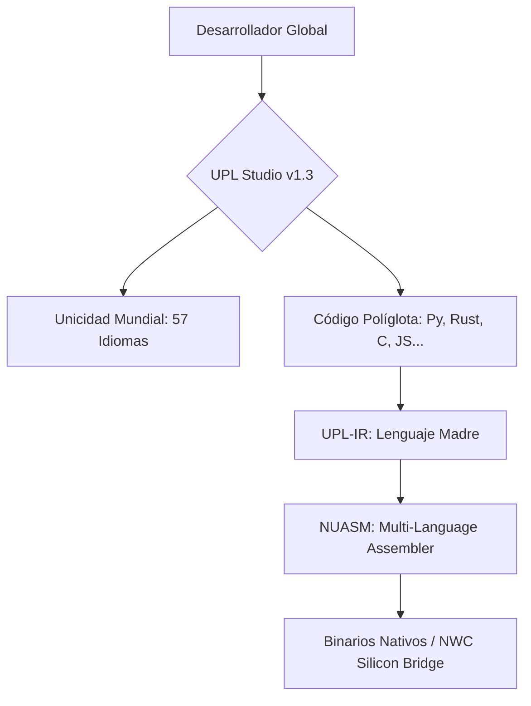

# UNIVERSAL POLYGLOT LAYER (UPL) 🛡️🌍🚀
## The Universal Omniglot Language of Neuro-OS

> **"Soberanía Lingüística Total: Unificando el Conocimiento del Mundo en una Sola Capa de Ejecución."**

---

## 🏛️ Visión Soberana
La **Universal Polyglot Layer (UPL)** es el corazón lingüístico de **Neuro-OS Genesis**. Actúa como un puente omníglota que permite la coexistencia y unificación de múltiples lenguajes de programación (C, Python, Rust, Go, JS, etc.) bajo un "Lenguaje Madre" (UPL-IR) y su posterior ejecución en la arquitectura **NUASM (MultiLang-ASM)**.

UPL no es solo un compilador; es un sistema de **Soberanía Lingüística** que devuelve al desarrollador el poder de crear sin barreras idiomáticas o técnicas.

---

## 🖥️ UPL Studio v1.3 (Sovereign Executive Edition)
El IDE profesional diseñado para liderar la era de la computación políglota.

### ✨ Características Principales
- **🚀 Ejecución Unificada (F5)**: Compila y ejecuta bloques de código de múltiples lenguajes en un solo flujo.
- **🌎 Unicidad Mundial**: Localización dinámica para **57 lenguajes y dialectos**. El IDE y el núcleo se adaptan a tu idioma nativo (EN, ES, RU, ZH, JA, KO, AR, etc.).
- **⌨️ Terminal Nativa**: Acceso real a PowerShell/Bash integrado directamente en el panel inferior.
- **🪲 Depuración y Corrección (F6/F7)**: Motores de traceado ASM y linting inteligente para asegurar la perfección del código.
- **📄 Multi-Pestaña y Autocompletado**: Interfaz fluida con sugerencias de mnemónicas adaptativas según la región seleccionada.

---

## 🏗️ Arquitectura del Ecosistema

---

## 🛠️ Modos de Soberanía (Atajos)
| Acción | Comando | Descripción |
| :--- | :--- | :--- |
| **Ejecutar** | `F5` | Proceso completo de unificación y salida. |
| **Depurar** | `F6` | Traceado ASM y mapeo de registros. |
| **Corregir** | `F7` | Análisis de consistencia y sintaxis. |
| **Explorador** | `Ctrl + B` | Alternar visibilidad del gestor de archivos. |
| **Terminal** | `Ctrl + J` | Abrir la terminal nativa real. |

---

## 📜 Licencia y Propiedad Intelectual
- **Versión v1.3**: Distribuida bajo **GNU General Public License v3.0 (GPL-3)**.
- **Futura v2**: Se lanzará bajo una licencia privada de uso comercial pagado.
- *Propiedad de la Comunidad Intelectual de Neuro-OS Genesis.*

---
**Diseñado con Soberanía por Neuro-OS Genesis.**
*"El mundo ya no está fragmentado; ahora tiene un solo lenguaje universal."*
