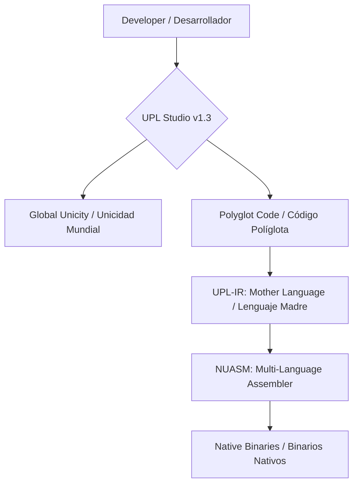

# UNIVERSAL POLYGLOT LAYER (UPL) 🛡️🌍🚀
## The Universal Omniglot Language of Neuro-OS / El Lenguaje Omníglota Universal de Neuro-OS

---

### [English] 🇬🇧

> **"Total Linguistic Sovereignty: Unifying World Knowledge in a Single Execution Layer."**

UPL is the linguistic heart of **Neuro-OS Genesis**. It acts as an omniglot bridge that allows multiple programming languages (C, Python, Rust, Go, JS, etc.) to coexist and unify under a "Mother Language" (UPL-IR) and subsequent execution in the **NUASM (MultiLang-ASM)** architecture.

#### ✨ Key Features
- **🚀 Unified Execution (F5)**: Compile and execute code blocks from multiple languages in a single flow.
- **🌎 Global Unicity**: Dynamic localization for **57 languages**. The IDE and core adapt to your native language.
- **⌨️ Native Terminal**: Real PowerShell/Bash access integrated directly into the bottom panel.
- **🪲 Debug & Correct (F6/F7)**: ASM tracing and smart linting engines.

---

### [Español] 🇪🇸

> **"Soberanía Lingüística Total: Unificando el Conocimiento del Mundo en una Sola Capa de Ejecución."**

La **Universal Polyglot Layer (UPL)** es el puente omníglota de **Neuro-OS Genesis** que permite que múltiples lenguajes (C, Python, Rust, Go, JS, etc.) coexistan y se unifiquen bajo un "Lenguaje Madre" (UPL-IR) para su ejecución en la arquitectura **NUASM**.

#### ✨ Características Principales
- **🚀 Ejecución Unificada (F5)**: Compila y ejecuta bloques de múltiples lenguajes en un solo flujo.
- **🌎 Unicidad Mundial**: Localización dinámica para **57 lenguajes**. El IDE y el núcleo se adaptan a tu idioma nativo.
- **⌨️ Terminal Nativa**: Acceso real a PowerShell/Bash integrado directamente en el panel inferior.
- **🪲 Depuración y Corrección (F6/F7)**: Motores de traceado ASM y linting inteligente.

---

## 🏗️ Architecture / Arquitectura

---

## 🛠️ Usage Modes / Modos de Uso
| Action / Acción | Command / Comando | Description / Descripción |
| :--- | :--- | :--- |
| **Run / Ejecutar** | `F5` | Unified process and output / Proceso unificado y salida. |
| **Debug / Depurar** | `F6` | ASM tracing / Traceado ASM. |
| **Correct / Corregir** | `F7` | Syntax consistency / Consistencia de sintaxis. |
| **Terminal** | `Ctrl + J` | Open native terminal / Abrir terminal nativa. |

---

**Neuro-OS Genesis - Linguistic Sovereignty Department.**
*"United by code, sovereign by language." / "Unidos por el código, soberanos por el lenguaje."*
