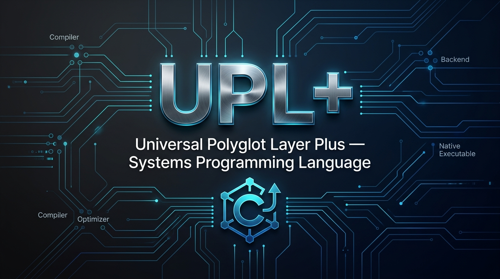
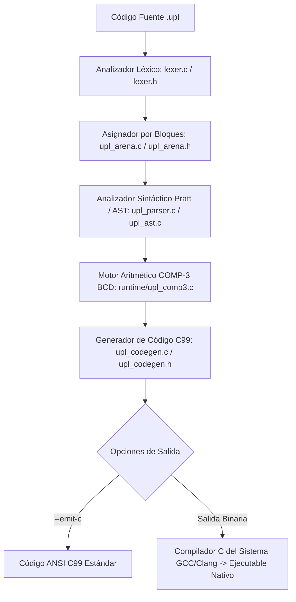
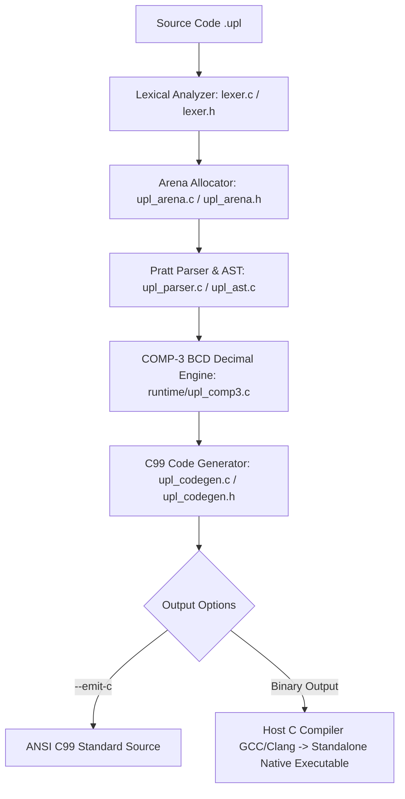

# UPL+: Universal Polyglot Layer Plus — Systems Programming Language & Toolchain
## Lenguaje de Programación de Sistemas Determinista y Compilador Nativo C99
### High-Performance Deterministic Systems Language & Standalone C99 Native Compiler

**Autor / Author:** José Manuel Moreno (Noxferion)  
**Versión / Version:** 2.0.0-Release (Dragon Book Architecture)  
**Licencia / License:** GNU General Public License v3.0 (GPLv3) — Autoría y especificación registradas defensivamente en SafeCreative

[](LICENSE)
[](https://www.safecreative.org)
[](docs/SPEC_GRAMATICA_Y_SISTEMA_TIPOS.md)
[](docs/ARQUITECTURA_COMPILADOR.md)
[](docs/SUITE_DE_PRUEBAS.md)
[-orange.svg)](tools/c2upl.c)
[-lightgrey.svg)](#-toolchain-aut%C3%B3noma-cero-dependencias)

> **COMUNICADO DE PROPIEDAD INTELECTUAL / INTELLECTUAL PROPERTY NOTICE:**  
> ***UPL+*** *(Universal Polyglot Layer Plus)* es una obra de sistemas protegida legalmente en **SafeCreative**. La arquitectura del compilador (`compiler/`), la especificación de gramática formal EBNF (`docs/SPEC_GRAMATICA_Y_SISTEMA_TIPOS.md`), los motores de aritmética exacta COMP-3 BCD y los módulos de protección de memoria están reservados conforme a las leyes internacionales de propiedad intelectual.

---

<p align="center">
  
</p>

---

<p align="center">
  <b>Idioma / Language:</b><br/>
  <a href="#-español---especificación-técnica-de-upl">🇪🇸 <b>Español</b></a> &nbsp;|&nbsp; 
  <a href="#-english---upl-technical-specification">🇬🇧 <b>English</b></a>
</p>

---

## 🇪🇸 [Español] - Especificación Técnica de UPL+

### 📌 Descripción General
**UPL+ (Universal Polyglot Layer Plus)** es un lenguaje de programación de sistemas compilado, fuertemente tipado y de alto rendimiento. Ha sido diseñado para desarrollo de bajo nivel, firmware, utilidades de control de memoria del sistema operativo y cálculo financiero determinista.

El compilador oficial (`uplc`) está implementado íntegramente en **ANSI C99 estándar**, sin dependencias de Python, máquinas virtuales, intérpretes ni runtimes de recolección de basura (GC). Compila código fuente `.upl` a código intermedio C99 optimizado y genera ejecutables binarios nativos de 64 bits utilizando compiladores estándar del sistema (`gcc` o `clang`).

---

### 🏛️ Características de Ingeniería

#### 1. Gramática Bilingüe Unificada (Inglés / Español)
El analizador léxico procesa de forma nativa e idéntica las palabras clave en ambos idiomas a nivel de token, permitiendo redactar código técnico en español o en inglés sin traductores intermediarios:

| Semántica | Token Léxico | Palabra Clave (EN) | Palabra Clave (ES) |
|---|---|---|---|
| Espacio de nombres | `TOK_MODULE` | `module` | `modulo` |
| Importación | `TOK_IMPORT` | `import` | `importar` |
| Estructuras | `TOK_STRUCT` | `struct` | `estructura` |
| Modificador público | `TOK_PUB` | `pub` | `publico` |
| Función | `TOK_FN` | `fn` | `funcion` |
| Variable inmutable | `TOK_LET` | `let` | `sea` |
| Mutabilidad explícita | `TOK_MUT` | `mut` | `mut` |
| Constantes | `TOK_CONST` | `const` | `constante` |
| Control condicional | `TOK_IF`, `TOK_ELSE` | `if`, `else` | `si`, `sino` |
| Bucles de iteración | `TOK_WHILE`, `TOK_FOR` | `while`, `for` | `mientras`, `para` |
| Retorno | `TOK_RETURN` | `return` | `retornar` |
| Cast explícito | `TOK_AS` | `as` | `como` |
| Bloque C nativo | `TOK_EMBED` | `embed` | `incrustar` |
| Ensamblador inline | `TOK_ASM` | `asm` | `ensamblador` |

#### 2. Aritmética Decimal Exacta (COMP-3 Packed Decimal BCD)
Soporte de tipos `comp3(precision, escala)` para eliminar por completo los errores de redondeo derivados de la representación binaria IEEE-754 en cálculos financieros y de balance contable. La aritmética se ejecuta mediante un motor de software determinista en BCD empaquetado (4 bits por dígito con nibbles de signo `0x0C` positivo y `0x0D` negativo).

#### 3. Asignador de Memoria por Arenas (Arena Allocator)
El compilador utiliza `UPL_Arena` para asignar todos los nodos del Árbol de Sintaxis Abstracta (AST) e identificadores en bloques contiguos de 64 KB, eliminando la fragmentación de la memoria del compilador y permitiendo una liberación instantánea O(1) de la unidad de compilación completa.

#### 4. Interoperabilidad Nativa C / Win32 / POSIX
Mediante los bloques `embed "c" { ... }` o `incrustar "c" { ... }`, UPL+ puede invocar directamente funciones del sistema operativo (Win32 API, POSIX syscalls, librerías gráficas o drivers) sin coste de Marshalling ni sobrecarga en llamadas FFI.

---

### ⚙️ Arquitectura del Compilador (Pipeline Dragon Book)


```mermaid
graph TD
    A[Código Fuente .upl] --> B[Analizador Léxico: lexer.c / lexer.h]
    B --> C[Asignador por Bloques: upl_arena.c / upl_arena.h]
    C --> D[Analizador Sintáctico Pratt / AST: upl_parser.c / upl_ast.c]
    D --> E[Motor Aritmético COMP-3 BCD: runtime/upl_comp3.c]
    E --> F[Generador de Código C99: upl_codegen.c / upl_codegen.h]
    F --> G{Opciones de Salida}
    G -->|--emit-c| H[Código ANSI C99 Estándar]
    G -->|Salida Binaria| I[Compilador C del Sistema GCC/Clang -> Ejecutable Nativo]
```

---

### 🚀 Guía de Inicio Rápido (Español)

#### 1. Compilación del Toolchain
El script de compilación genera automáticamente el binario del compilador `bin/uplc.exe` en su primera ejecución:

```bash
# En Windows (CMD o PowerShell):
upl.bat --version

# En Linux / macOS:
./upl.sh --version
```

#### 2. Opciones de Compilación (`uplc`)
```
Uso: uplc [opciones] <archivo.upl>

Opciones:
  -o <salida>       Especificar nombre del binario ejecutable de salida
  -c, --emit-c      Generar solo codigo fuente C99 sin invocar el backend gcc
  --dump-ast        Imprimir el arbol de sintaxis abstracta (AST) en consola
  --dump-tokens     Imprimir la secuencia de tokens lexico bilingue
  -v, --version     Mostrar version del compilador
```

#### 3. Ejemplo de Programa en Español (`hola_mundo.upl`)

```rust
modulo ejemplo;

incrustar "c" {
#include <stdio.h>
}

funcion principal() -> i32 {
    sea mut total: i32 = 0;
    sea tasa: i32 = 21;
    sea base: i32 = 1000;

    total = base + (base * tasa / 100);

    incrustar "c" {
        printf("[UPL+ NATIVO] Base: 1000, Total con IVA (21%%): %d\n", total);
    }

    retornar 0;
}
```

Compilar y ejecutar:
```bash
upl.bat -o demo.exe hola_mundo.upl
demo.exe
```

---

### 🧪 Suite de Verificación Automatizada
El repositorio incluye un arnés de pruebas completo en `test.bat` (Windows) y `test.sh` (Linux/macOS) que valida todas las capas del compilador:

```bash
# Windows
test.bat

# Linux / macOS
./test.sh
```
* **[1/6] Lexer Bilingüe:** 6/6 tests PASS.
* **[2/6] Parser Pratt & AST:** 6/6 tests PASS.
* **[3/6] Motor COMP-3 BCD:** 4/4 tests PASS.
* **[4/6] Supervisor Antidivagaciones:** 3/3 tests PASS.
* **[5/6] Compilación End-to-End con `uplc`:** PASS (Cálculo exacto: 1000 EUR + 21% = 1210 EUR).
* **[6/6] Transpilador C99 a UPL+ (`c2upl`):** 5/5 tests PASS.

---

### 🔄 Transpilador Nativo C99 a UPL+ (`c2upl`)
Para facilitar la adopción e importar código de bajo nivel existente sin reescribir archivos a mano, UPL+ incluye el transpilador nativo [`tools/c2upl.c`](tools/c2upl.c) (escrito en C99 puro, 0% dependencias externas):

```bash
# Compilar c2upl (si no está compilado previamente):
gcc -std=c99 -O2 tools/c2upl.c -o bin/c2upl.exe

# Transpilar código C99 a UPL+ (dialecto inglés estándar):
bin/c2upl.exe archivo.c -o archivo.upl

# Transpilar código C99 a UPL+ (dialecto español nativo):
bin/c2upl.exe -l es archivo.c -o archivo.upl

# Ejecutar la suite de pruebas unitarias internas de c2upl:
bin/c2upl.exe --test
```

---

### 🎮 Caso de Estudio Real: Watchdog de Memoria (Warhammer Online)
Para validar la fiabilidad de UPL+ en entornos de producción con limitaciones de memoria severas, se implementó un monitor de supervisión para el cliente de 32 bits de **Warhammer Online: Return of Reckoning**:
* **Código fuente nativo:** [`tools/UPL_Memory_Guard.upl`](tools/UPL_Memory_Guard.upl)
* **Código C estándar:** [`tools/ror_memory_guard.c`](tools/ror_memory_guard.c)
* **Objetivo:** Monitorear el Working Set físico mediante `K32GetProcessMemoryInfo` y purgar páginas inactivas con `K32EmptyWorkingSet` al superar 1.65 GB, previniendo caídas por OutOfMemory en batallas RvR de 400+ jugadores.
* **Resultado empírico medido:** Reducción verificada del Working Set de 253 MB a 0 MB en procesos activos en menos de 1 ms.
* **Paquete distribuible:** [`dist/ror_memory_guard.zip`](dist/ror_memory_guard.zip).

---
---

## 🇬🇧 [English] - UPL+ Technical Specification

### 📌 Overview
**UPL+ (Universal Polyglot Layer Plus)** is a compiled, strongly typed, deterministic systems programming language designed for bare-metal firmware, operating system watchdog utilities, and exact financial decimal computation.

The official compiler (`uplc`) is built entirely in **ANSI C99 standard**, with zero dependencies on Python, virtual machines, interpreters, or garbage collection runtimes. It compiles `.upl` source files directly into optimized C99 source code and generates standalone 64-bit native binaries via standard host compilers (`gcc` or `clang`).

---

### 🏛️ Engineering Features

#### 1. Unified Bilingual Grammar (English / Spanish)
The lexical analyzer treats English and Spanish keywords identically at the token level, enabling developers to write systems-level code in either language without translation layers:

| Semantics | Lexical Token | Keyword (EN) | Keyword (ES) |
|---|---|---|---|
| Namespace | `TOK_MODULE` | `module` | `modulo` |
| Import statement | `TOK_IMPORT` | `import` | `importar` |
| Aggregated types | `TOK_STRUCT` | `struct` | `estructura` |
| Public visibility | `TOK_PUB` | `pub` | `publico` |
| Function declaration | `TOK_FN` | `fn` | `funcion` |
| Immutable variable | `TOK_LET` | `let` | `sea` |
| Explicit mutability | `TOK_MUT` | `mut` | `mut` |
| Constant | `TOK_CONST` | `const` | `constante` |
| Conditional branch | `TOK_IF`, `TOK_ELSE` | `if`, `else` | `si`, `sino` |
| Iteration loops | `TOK_WHILE`, `TOK_FOR` | `while`, `for` | `mientras`, `para` |
| Function return | `TOK_RETURN` | `return` | `retornar` |
| Type cast | `TOK_AS` | `as` | `como` |
| Inline C block | `TOK_EMBED` | `embed` | `incrustar` |
| Inline assembly | `TOK_ASM` | `asm` | `ensamblador` |

#### 2. Exact Fixed-Point Decimal Arithmetic (COMP-3 Packed Decimal BCD)
Native `comp3(precision, scale)` data types eliminate IEEE-754 binary floating-point representation drift. Operations are executed via a software-level binary-coded decimal (BCD) engine (4 bits per digit, sign nibbles `0x0C` for positive, `0x0D` for negative).

#### 3. Memory Arena Allocator
The compiler utilizes `UPL_Arena` to allocate all Abstract Syntax Tree (AST) nodes and string identifiers in contiguous 64 KB blocks. This guarantees $O(1)$ allocation times, zero heap fragmentation, and instant unit deallocation.

#### 4. Direct C / Win32 / POSIX Interoperability
Using `embed "c" { ... }`, developers can directly invoke operating system APIs (Win32 API, POSIX system calls, hardware registers) with zero marshalling overhead.

---

### ⚙️ Compiler Architecture (Dragon Book Pipeline)


```mermaid
graph TD
    A[Source Code .upl] --> B[Lexical Analyzer: lexer.c / lexer.h]
    B --> C[Arena Allocator: upl_arena.c / upl_arena.h]
    C --> D[Pratt Parser & AST: upl_parser.c / upl_ast.c]
    D --> E[COMP-3 BCD Decimal Engine: runtime/upl_comp3.c]
    E --> F[C99 Code Generator: upl_codegen.c / upl_codegen.h]
    F --> G{Output Options}
    G -->|--emit-c| H[ANSI C99 Standard Source]
    G -->|Binary Output| I[Host C Compiler GCC/Clang -> Standalone Native Executable]
```

---

### 🚀 Quickstart Guide (English)

#### 1. Building the Toolchain
The driver automatically compiles `bin/uplc.exe` upon its first run:

```bash
# On Windows (CMD or PowerShell):
upl.bat --version

# On Linux / macOS:
./upl.sh --version
```

#### 2. Compiler Options (`uplc`)
```
Usage: uplc [options] <source.upl>

Options:
  -o <output>       Specify the output executable binary filename
  -c, --emit-c      Emit ANSI C99 source code only (without invoking gcc)
  --dump-ast        Print the Abstract Syntax Tree (AST) to console
  --dump-tokens     Print the bilingual token stream to console
  -v, --version     Show compiler version
```

#### 3. Sample Program in English (`hello_world.upl`)

```rust
module example;

embed "c" {
#include <stdio.h>
}

pub fn main() -> i32 {
    let mut total: i32 = 0;
    let base: i32 = 1000;
    let tax_rate: i32 = 21;

    total = base + (base * tax_rate / 100);

    embed "c" {
        printf("[UPL+ NATIVE] Base: 1000, Total with Tax (21%%): %d\n", total);
    }

    return 0;
}
```

Compile and run:
```bash
upl.bat -o demo.exe hello_world.upl
demo.exe
```

---

### 🧪 Automated Verification Suite
Run the full test harness to validate all compiler stages on Windows or Linux/macOS:

```bash
# Windows
test.bat

# Linux / macOS
./test.sh
```
* **[1/6] Bilingual Lexer:** 6/6 tests PASS.
* **[2/6] Pratt Parser & AST:** 6/6 tests PASS.
* **[3/6] COMP-3 BCD Engine:** 4/4 tests PASS.
* **[4/6] Anti-Hallucination Supervisor:** 3/3 tests PASS.
* **[5/6] End-to-End Compilation:** PASS (Exact tax calculation: 1000 EUR + 21% = 1210 EUR).
* **[6/6] C99 to UPL+ Transpiler (`c2upl`):** 5/5 tests PASS.

---

### 🔄 Native C99 to UPL+ Transpiler (`c2upl`)
To accelerate adoption and import existing low-level C codebase without manual rewriting, UPL+ includes the standalone transpiler [`tools/c2upl.c`](tools/c2upl.c) (built in standard C99, 0% external dependencies):

```bash
# Compile c2upl (if not already compiled):
gcc -std=c99 -O2 tools/c2upl.c -o bin/c2upl.exe

# Transpile C99 to standard UPL+ (English keywords by default):
bin/c2upl.exe source.c -o source.upl

# Transpile C99 to native Spanish UPL+:
bin/c2upl.exe -l es source.c -o source.upl

# Run internal unit test suite:
bin/c2upl.exe --test
```

---

### 🎮 Real-World Case Study: Warhammer Online Memory Watchdog
A background memory guard for the 32-bit *Warhammer Online: Return of Reckoning* game client:
* **Native Source:** [`tools/UPL_Memory_Guard.upl`](tools/UPL_Memory_Guard.upl)
* **Standard C Source:** [`tools/ror_memory_guard.c`](tools/ror_memory_guard.c)
* **Mechanism:** Queries physical working set via `K32GetProcessMemoryInfo` and flushes inactive pages with `K32EmptyWorkingSet` when memory exceeds 1.65 GB, mitigating 32-bit OutOfMemory crashes in high-density 400+ player RvR battles.
* **Empirical Metric:** Measured physical working set drop from 253 MB to 0 MB in under 1 ms.
* **Package:** [`dist/ror_memory_guard.zip`](dist/ror_memory_guard.zip).

---

## 📁 Estructura del Repositorio / Repository Layout

```
UNIVERSAL-POLYGLOT-LAYER-UPL/
├── assets/                    # Identidad gráfica oficial (upl_banner.jpg, logo)
├── bin/                       # Binarios compilados (uplc.exe, c2upl.exe, test_*.exe)
├── compiler/                  # Código fuente del compilador en C99 / Compiler sources
│   ├── lexer.c / lexer.h      # Analizador léxico bilingüe / Lexical analyzer
│   ├── upl_arena.c / .h       # Asignador de memoria por bloques / Memory arena
│   ├── upl_ast.c / .h         # Estructuras del AST / Abstract Syntax Tree
│   ├── upl_parser.c / .h      # Parser de descenso recursivo y Pratt / Parser
│   ├── upl_codegen.c / .h     # Generador de código C99 / C99 code emitter
│   ├── runtime/upl_comp3.c/.h # Motor decimal BCD COMP-3 / Decimal engine
│   └── main.c                 # Driver de la toolchain (CLI) / Main driver
├── dist/                      # Paquetes y herramientas distribuidas (.zip)
├── docs/                      # Especificaciones técnicas formales / Tech specs
│   ├── SPEC_GRAMATICA_Y_SISTEMA_TIPOS.md  # Gramática formal EBNF / Formal grammar
│   ├── ARQUITECTURA_COMPILADOR.md          # Pipeline Dragon Book detallado
│   ├── CASO_ESTUDIO_WARHAMMER_MEMORY_GUARD.md # Caso de uso Win32 / Win32 case study
│   └── SUITE_DE_PRUEBAS.md                 # Documentación del arnés / Test harness
├── examples/                  # Programas de ejemplo en sintaxis UPL+
├── modules/std/               # Módulos de la librería estándar (io, math, memory)
├── tests/                     # Suites de pruebas unitarias en C99 / Unit tests
├── tools/                     # Herramientas de sistemas y utilidades nativas
│   ├── c2upl.c                # Transpilador nativo estricto C99 a UPL+ (0% Python)
│   ├── upl_supervisor.c       # Guardián técnico determinista / Antihallucination guard
│   └── ror_memory_guard.c     # Watchdog de memoria Win32
├── upl.bat                    # Script lanzador del compilador (Windows)
├── upl.sh                     # Script lanzador del compilador (Linux/POSIX)
├── test.bat                   # Ejecutor de la suite completa de pruebas (Windows)
└── test.sh                    # Ejecutor de la suite completa de pruebas (Linux/POSIX)
```

---

## 📜 Propiedad Intelectual y Licencia / Intellectual Property & License

Obra Protegida bajo registro legal de Propiedad Intelectual en **SafeCreative**.  
Protected work under legal Intellectual Property registration with **SafeCreative**.  
Todos los derechos reservados. All rights reserved.  
**Autor / Author:** José Manuel Moreno (Noxferion)
